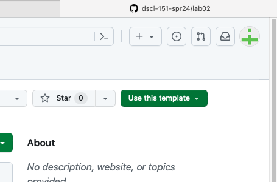

```{r include = FALSE}
knitr::opts_chunk$set(
  eval = FALSE,
  out.width = "80%",
  fig.asp = 0.618,
  fig.width = 6
)
```

```{r photo, fig.margin = TRUE, echo = FALSE, fig.width = 3, fig.cap = "Photo by Madeleine Kohler on Unsplash", eval = TRUE}
knitr::include_graphics("img/madeleine-kohler-90Qn643Pq9c-unsplash.jpg")
```

Once upon a time, people travelled all over the world, and some stayed in hotels and others chose to stay in other people's houses that they booked through Airbnb.
Recent developments in Edinburgh regarding the growth of Airbnb and its impact on the housing market means a better understanding of the Airbnb listings is needed.
Using data provided by Airbnb, we can explore how Airbnb availability and prices vary by neighbourhood.

# Getting started

[Go to Homework]((https://github.com/dsci-151-spr24/hw01))

Then make your own copy of this by clicking on `Use this template`:

```{r git-template, fig.fullwidth=TRUE, echo = FALSE}

```

Grab the URL of the repo, and clone it in RStudio.
Refer to Lab 01 if you would like to see step-by-step instructions for cloning a repo into an RStudio project.

First, open the R Markdown document `hw-01-airbnb-edi.Rmd` and Knit it.
Make sure it compiles without errors.
The output will be in the file markdown `.md` file with the same name.

## Warm up

Before we introduce the data, let's warm up with some simple exercises.

-   Update the YAML, changing the author name to your name, and **knit** the document.
-   Commit your changes with a meaningful commit message.
-   Push your changes to GitHub.
-   Go to your repo on GitHub and confirm that your changes are visible in your Rmd **and** md files. If anything is missing, commit and push again.

## Packages

We'll use the **tidyverse** package for much of the data wrangling and visualisation and the data lives in the **dsbox** package.
These packages are already installed for you.
You can load them by running the following in your Console:

```{r load-packages, message = FALSE}
library(tidyverse)
library(dsbox)
```

## Data

The data can be found in the **dsbox** package, and it's called `edibnb`.
Since the dataset is distributed with the package, we don't need to load it separately; it becomes available to us when we load the package.

You can view the dataset as a spreadsheet using the `View()` function.
Note that you should not put this function in your R Markdown document, but instead type it directly in the Console, as it pops open a new window (and the concept of popping open a window in a static document doesn't really make sense...).
When you run this in the console, you'll see the following **data viewer** window pop up.

```{r view-data}
View(edibnb)
```

You can find out more about the dataset by inspecting its documentation, which you can access by running `?edibnb` in the Console or using the Help menu in RStudio to search for `edibnb`.
You can also find this information [here](https://rstudio-education.github.io/dsbox/reference/edibnb.html).

# Exercises

```{marginfigure}
**Hint:** The Markdown Quick Reference sheet has an example of inline R code that might be helpful. You can access it from the Help menu in RStudio.
```

1.  How many observations (rows) does the dataset have? Instead of hard coding the number in your answer, use inline code.

The dataset has **13245** rows

2.  Run `View(edibnb)` in your Console to view the data in the data viewer. What does each row in the dataset represent?

Each row represents a different Airbnb listing and coincides with the columns to describe that specific listing's, id, price, neighbourhood, accommodation size, number of bathrooms, number of bedrooms, number of beds, review rating, number of reviews, and listing URL.

🧶 ✅ ⬆️ *Knit,* *commit, and push your changes to GitHub with an appropriate commit message. Make sure to commit and push all changed files so that your Git pane is cleared up afterwards.*

Each column represents a variable.
We can get a list of the variables in the data frame using the `names()` function.

```{r}
names(edibnb)
```

You can find descriptions of each of the variables in the help file for the dataset, which you can access by running `?edibnb` in your Console.

```{marginfigure}
**Note:** The plot will give a warning about some observations with non-finite values for price being removed. Don't worry about the warning, it simply means that 199 listings in the data didn't have prices available, so they can't be plotted.
```

3.  Create a faceted histogram where each facet represents a neighbourhood and displays the distribution of Airbnb prices in that neighbourhood. Think critically about whether it makes more sense to stack the facets on top of each other in a column, lay them out in a row, or wrap them around. Along with your visualisation, include your reasoning for the layout you chose for your facets.

```{r airbnb_price_neighbourhood_distribution}

library(ggplot2)
ggplot(edibnb, aes(x = price)) +
  geom_histogram(binwidth = 15) +
  facet_wrap(~neighbourhood, scales = "fixed") +
  labs(
    title = "Distribution of Airbnb Prices by Neighbourhood"
  )


```

**When typing eval=TRUE to present ggplot as visual I am left with the following message...**

Error:
! object 'edibnb' not found
Backtrace:
 1. ggplot2::ggplot(edibnb, aes(x = price))
Execution halted

*For this reason I have decided to skip visual presentation on exercise 3*

**Facet Reasoning**
I decided to use the variable *neighbourhood* for my facet wrap to ensure that the viewer could easily compare the prices of Airbnbs in a specific area. I tested both a fixed and free scale. However, for the sake of wholesale cost comparison, a fixed scale was able to more easily compare the prices. The biggest problem with *neighbourhood* as the facet variable is that it takes up a large amount of space.

Let's de-construct this code:

-   `ggplot()` is the function we are using to build our plot, in layers.
-   In the first layer we always define the data frame as the first argument. Then, we define the mappings between the variables in the dataset and the **aes**thetics of the plot (e.g. x and y coordinates, colours, etc.).
-   In the next layer we represent the data with **geom**etric shapes, in this case with a histogram. You should decide what makes a reasonable bin width for the histogram by trying out a few options.
-   In the final layer we facet the data by neighbourhood.

🧶 ✅ ⬆️ Knit, *commit, and push your changes to GitHub with an appropriate commit message. Make sure to commit and push all changed files so that your Git pane is cleared up afterwards.*

4.  Use a single pipeline to identity the neighbourhoods with the top five median listing prices. Then, in another pipeline filter the data for these five neighbourhoods and make ridge plots of the distributions of listing prices in these five neighbourhoods. In a third pipeline calculate the minimum, mean, median, standard deviation, IQR, and maximum listing price in each of these neighbourhoods. Use the visualisation and the summary statistics to describe the distribution of listing prices in the neighbourhoods. (Your answer will include three pipelines, one of which ends in a visualisation, and a narrative.)

**Part 1 - Neighbourhoods with the top five median listing price:**

New Town, Old Town, West End, Stockbridge, and Bruntsfield

**Part 2 - Ridge Plot**

```{r airbnb_prices_top_neighbourhoods}

library(ggplot2)
ggplot(filtered_data, aes(x = price, y = neighbourhood, fill = neighbourhood)) +
  geom_density_ridges() +
  labs(
    title = "Distribution of Airbnb Prices in Top 5 Neighbourhoods",
    x = "Listing Price",
    y = "Neighbourhood"
  )

```

**Part 3 -Narrative Explantion**

```{r airbnb_prices_top_neighbourhoods_summary}

library(ggplot2)
ggplot(filtered_data, aes(x = neighbourhood, y = price, fill = neighbourhood)) +
  geom_boxplot() +
  labs(
    title = "Summary of Airbnb Prices in Top 5 Neighbourhoods",
    x = "Neighbourhood",
    y = "Listing Price"
  )

```

The following graph shows that New Town, Old Town, and West End, each share the highest single value airbnb at a price of 1000. However, the median highest is New Town at 136.
Listed are the following minimum, mean, and prices, as well as standard deviation for the 5 towns.

The visualization of the filtered, 5 top neighbourhoods, shows that West End has the average hightest listing price. This is followed by Stockbridge, Old Town, New Town, and Bruntsfield.
*Bruntsfield*: Minimum price = 10, mean price = 99.4, median price = 80, standard deviation is 90.2.
*New Town*: Minimum price = 12, mean price = 136, median price = 100, standard deviation is 109
*Old Town*: Minimum price = 15, mean price = 128, median price = 110, standard deviation is 110
*Stockbridge*: Minimum price = 121, mean price = 104, median price = 85, standard deviation is 77.6
*West End*: Minimum price = 19, mean price = 116, median price = 90, standard deviation is 93.3

5.  Create a visualization that will help you compare the distribution of review scores (`review_scores_rating`) across neighbourhoods. You get to decide what type of visualisation to create and there is more than one correct answer! In your answer, include a brief interpretation of how Airbnb guests rate properties in general and how the neighbourhoods compare to each other in terms of their ratings.

🧶 ✅ ⬆️ Knit, *commit, and push your changes to GitHub with an appropriate commit message. Make sure to commit and push all changed files so that your Git pane is cleared up afterwards and review the md document on GitHub to make sure you're happy with the final state of your work.*

*Save a pdf version and submit to moodle*
